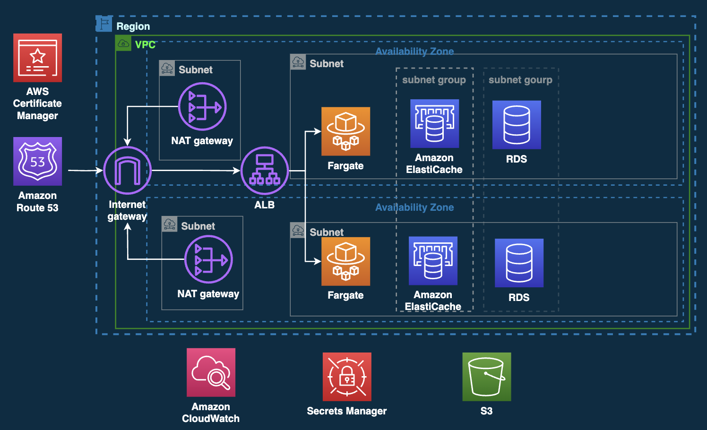

# Example for deploy nginx to Amazon ECS by Terraform

## Setup
```
brew install tfenv
brew tap hashicorp/tap
brew install hashicorp/tap/terraform

cd envs/$ENV && tfenv install
```

## Architectue



## Prepare
1. Make a s3 bucket for terraform backend
Write bucket name to `00-main.tf`
```
terraform {
  backend "s3" {
    bucket  = "<your bucket name for terraform backend>"
    region  = "ap-northeast-1"
    key     = "tfstate"
    profile = "my-user-terraform" #your profile
  }
  required_providers {
    aws = {
      version = "~> 3.34.0"
    }
  }
}
```

2. Edit `variables.tf` for your project
```
//export
locals {
  alb = {
    certificate_arn = ""
  }
  
  redis = {
    node_type = "cache.t2.micro"
  }

  rds = {
    node_type = "db.t3.micro"
  }

  ecs = {
    memory = "1024"
    cpu = "512"
  }
}
```

3. Make a s3 bucket and write the bucket name for it to variables.tf`
```
//export
locals {
  s3 = { # These must be unique in the world.
    bucket_name = "your-bucket-name" # edit here
  }
}
```

4. Put encryption key and secret in secretsmanager and write the path to `variables.tf`
```
locals {
  sm = {
    hoge_secret_name = ""
  }
}
```

## Deploy
```
terraform apply
```

